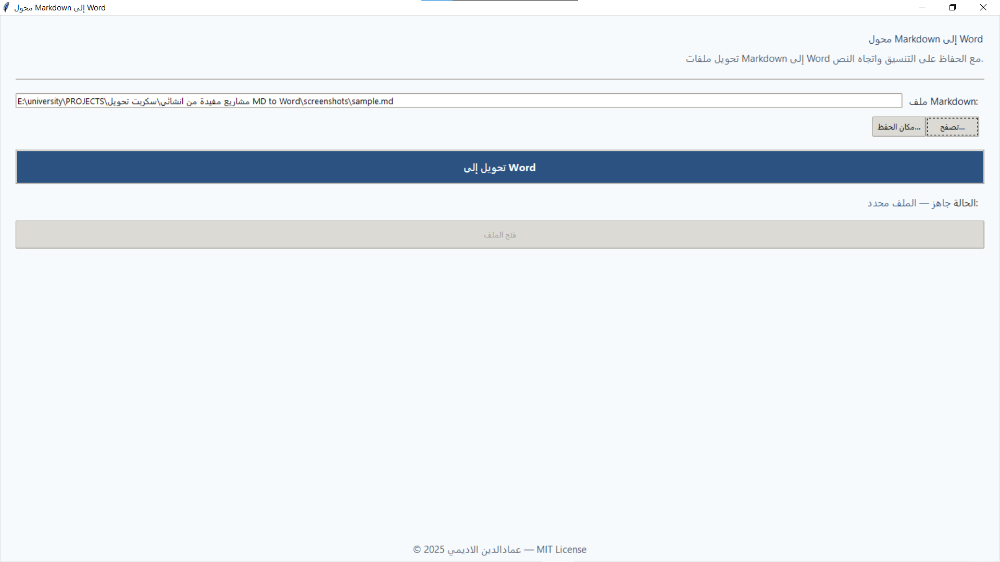
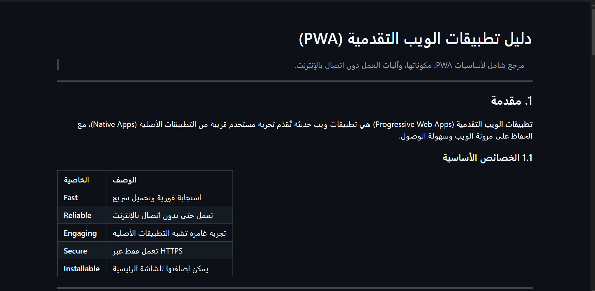
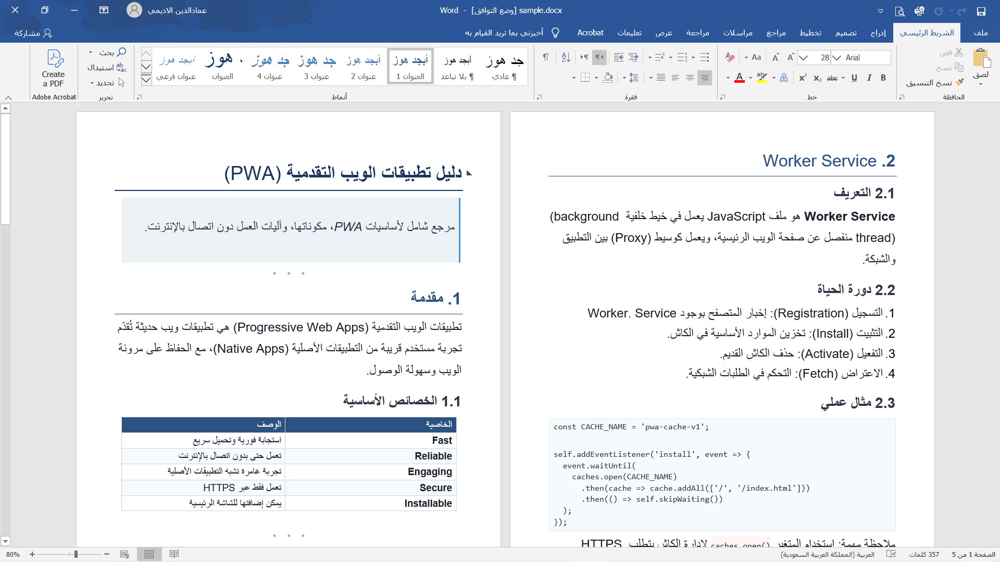

# MarkdownToWord 🚀

> محوّل احترافي من ملفات **Markdown** إلى **Word (.docx)** مع دعم كامل للغة العربية (RTL) وتصميم أكاديمي أنيق — **بواجهة رسومية عربية وملف EXE جاهز**.

[](https://www.python.org/)
[](https://python-docx.readthedocs.io/)
[](LICENSE)
[]()

---

## 📸 صور

### الواجهة الرسومية



### مثال على النتيجة

| قبل التحويل | بعد التحويل |
|-------------|-------------|
|  |  |

---

## 📖 نبذة

عند نسخ ملخصات الدراسة من **Obsidian** أو **Markdown** إلى **Word**، تظهر مشاكل متعددة:

- ❌ النص العربي يُعرض بمحاذاة يسار بدل يمين
- ❌ الأقواس وعلامات التنصيص تنعكس `)Native Apps(`
- ❌ الجداول لا تُكتشف أو تظهر كنص خام
- ❌ القوائم تُدمج مع الفقرة السابقة
- ❌ الأكواد تُعرض بدون تنسيق
- ❌ صفحات مشوّهة وتنسيق عشوائي

هذا البرنامج يحل كل هذه المشاكل دفعة واحدة، ويعطيك ملف Word **جاهزًا للتسليم أو الطباعة** بتصميم احترافي.

---

## ✨ المميزات

### 🖥️ واجهة رسومية بسيطة

- واجهة عربية نظيفة بـ Tkinter
- اختيار ملف `.md` بزر "تصفح..."
- تحديد مكان الحفظ (اختياري)
- زر "تحويل إلى Word"
- زر "فتح الملف" بعد التحويل
- عرض الحالة في الوقت الفعلي
- تحويل في Thread منفصل (لا يجمد الواجهة)

### 🔤 دعم كامل للعربية

- **محاذاة يمين صحيحة** باستخدام `w:jc="start"`
- **إصلاح انعكاس الأقواس** عبر تقسيم النص حسب الاتجاه
- **دعم `w:szCs`** لضمان حجم خط موحّد
- **RTL** على مستوى المستند والجداول والفقرات

### 📝 معالجة شاملة لـ Markdown

| العنصر | المعالجة |
|--------|---------|
| عناوين `#`..`######` | ألوان متناسبة + خط سفلي لـ H1/H2 |
| فقرات | حجم 18pt + تباعد 1.5 |
| قوائم `-` و `1.` | قوائم Word حقيقية (تداخل) |
| جداول `\|` | Zebra Striping + رأس أزرق داكن |
| أكواد ` ``` ` | Consolas + إطار ناعم |
| `**Bold**` | Bold + لون أزرق |
| `*Italic*` | مائل |
| `[رابط](url)` | Hyperlink قابل للنقر |
| `> اقتباس` | شريط جانبي أزرق |
| `---` | نقاط أنيقة `• • •` |
| `` `code` `` | خلفية وردية + خط أحمر |

### 🛡️ متانة وأمان

- **حفظ آمن**: لا يفشل إذا كان الملف مفتوحًا في Word
- **اسم بديل تلقائي**: `file (1).docx`
- **تحذير مبكّر** قبل بدء التحويل
- **معالجة شاملة** للأخطاء

### 🎯 مزايا إضافية

- **فهرس تلقائي (TOC)**: عند وجود عنوان "المحتويات"
- **حجم خط متكيف** للجداول
- **عرض أعمدة ذكي** حسب المحتوى
- **تكرار رأس الجدول** في كل صفحة
- **ترقيم صفحات** في التذييل

---

## 🚀 التثبيت

### الطريقة 1: استخدام EXE مباشرة (للمستخدمين النهائيين) ⭐

1. اذهب إلى [Releases](https://github.com/emadaldin2003/md-to-docx-rtl/releases)
2. حمّل `MarkdownToWord.exe`
3. شغّله مباشرة — **لا يحتاج Python**

### الطريقة 2: من الكود المصدري (للمطورين)

```bash
# استنساخ المستودع
git clone https://github.com/emadaldin2003/md-to-docx-rtl.git
cd md-to-docx-rtl

# تثبيت المكتبات
pip install -r requirements.txt
```

---

## 🎮 الاستخدام

### الطريقة 1: الواجهة الرسومية (الأسهل)

```bash
python md_to_docx_rtl.py
```

ستفتح نافذة:

1. اضغط **"تصفح..."** واختر ملف `.md`
2. (اختياري) اضغط **"مكان الحفظ..."** لتحديد مسار DOCX
3. اضغط **"تحويل إلى Word"**
4. اضغط **"فتح الملف"** لفتح DOCX

### الطريقة 2: سطر الأوامر (CLI)

```bash
# تحويل مباشر (ينشئ file.docx بجانب file.md)
python md_to_docx_rtl.py "ملخص.md"

# تحديد ملف الإخراج
python md_to_docx_rtl.py "ملخص.md" "النتيجة.docx"
```

### الطريقة 3: من داخل Python

```python
from md_to_docx_rtl import convert_md_to_docx

convert_md_to_docx("ملخص.md", "النتيجة.docx")
```

---

## ⚙️ الإعدادات

كل الإعدادات في أعلى `md_to_docx_rtl.py`:

### أحجام الخطوط

```python
BODY_SIZE = 18                    # النص العادي
CODE_SIZE = 12                    # الأكواد
HEADING_SIZES = {1: 28, 2: 24, 3: 21, 4: 19, 5: 18, 6: 18}
```

### أحجام خط الجداول

```python
TABLE_FONT_SIZES = {
    1: 15, 2: 14, 3: 13, 4: 13,
    5: 12, 6: 11, 7: 10, 8: 10,
}
```

### الخطوط

```python
DEFAULT_FONT = "Arial"
CODE_FONT = "Consolas"
```

### لوحة الألوان

```python
COLORS = {
    "h1": "1A365D",                 # أزرق داكن
    "h2": "2C5282",                 # أزرق متوسط
    "bold": "2B6CB0",               # Bold
    "table_header_bg": "2C5282",    # رأس الجدول
    "table_stripe": "F7FAFC",       # Zebra
    "inline_code_fg": "C53030",     # inline code
    # ...
}
```

---

## 🔨 بناء EXE بنفسك

```bash
# تثبيت PyInstaller
pip install pyinstaller

# بناء EXE
pyinstaller --onefile --windowed --name "MarkdownToWord" --icon "app.ico" md_to_docx_rtl.py
```

**النتيجة**: `dist/MarkdownToWord.exe`

### إضافة معلومات الإصدار (اختياري)

أنشئ ملف `version_info.txt` وابنِ مع `--version-file version_info.txt`.

---

## 🧪 الاختبارات

| السيناريو | الحالة |
|-----------|--------|
| ملف عربي | ✅ |
| ملف مختلط (عربي + English) | ✅ |
| أرقام | ✅ |
| Code blocks | ✅ |
| Inline code | ✅ |
| جداول | ✅ |
| عناوين | ✅ |
| قوائم (متداخلة) | ✅ |
| روابط | ✅ |
| أقواس وعلامات ترقيم | ✅ |
| مسارات عربية | ✅ |
| مسارات بمسافات | ✅ |
| ملف موجود مسبقًا | ✅ |
| ملف مفتوح في Word | ✅ |

---

## 🛠️ كيف يعمل

```
ملف Markdown (.md)
        ↓
1) المعالجة المسبقة
   - إضافة سطر فارغ قبل الجداول والقوائم
   - إزالة الشرطة المائلة عند اتباعها بقائمة
   - حماية محتوى كتل الأكواد
        ↓
2) markdown → HTML
        ↓
3) BeautifulSoup
   - تحليل بنية HTML
        ↓
4) python-docx
   - بناء Word بألوان وأنماط
        ↓
5) الحفظ الآمن
   - إن فشل: توليد اسم بديل
        ↓
ملف Word (.docx)
```

### حل مشكلة الأقواس المنعكسة

النص يُقسّم إلى runs حسب الاتجاه:

```python
[('rtl', 'منصة الويب '), ('ltr', '(The Web Platform)')]
```

كل run يُوسَم بـ `w:rtl=1` أو `w:rtl=0`. الأقواس تبقى مع محتواها اللاتيني → لا تنعكس.

### حل مشكلة حجم الخط العربي

Word يستخدم `w:szCs` للنص العربي. إذا لم يُضبط، يستخدم ~11pt.

**الحل**: دالة `set_run_size` تضبط `w:sz` و `w:szCs` معًا.

---

## 🐛 المشاكل الشائعة

### EXE لا يفتح
- جرّب تشغيله من CMD لرؤية الخطأ
- تأكد من صلاحيات المسؤول

### الأقواس مازالت تنعكس
- غيّر `w:jc="start"` إلى `w:jc="both"` في `set_paragraph_direction`

### `PermissionError` عند التحويل
- البرنامج يولّد اسمًا بديلًا تلقائيًا
- أو أغلق Word وأعد المحاولة

### خطوط غير موجودة
- غيّر `DEFAULT_FONT` إلى `"Calibri"` أو خط مثبت

---

## 🤝 المساهمة

نرحّب بالمساهمات! افتح **Issue** أولًا لمناقشة التغييرات الكبيرة.

### أسلوب الـ Commits

- `feat:` ميزة جديدة
- `fix:` إصلاح خطأ
- `docs:` توثيق
- `refactor:` إعادة هيكلة

---

## 📄 الترخيص

هذا المشروع مرخّص بموجب **MIT License** — راجع ملف [LICENSE](LICENSE) للتفاصيل.

**باختصار**: يمكنك استخدامه وتعديله وتوزيعه بحرية، بشرط ذكر اسم المؤلف في النسخ المشتقة.

---

## 👤 المؤلف

**عمادالدين الاديمي**

- 🐙 GitHub: [@emadaldin2003](https://github.com/emadaldin2003)
- 📷 Instagram: [@e.4_m](https://www.instagram.com/e.4_m)

---

## 📬 التواصل والدعم

- 🐛 [الإبلاغ عن مشاكل](https://github.com/emadaldin2003/md-to-docx-rtl/issues)
- 💡 [اقتراح ميزة](https://github.com/emadaldin2003/md-to-docx-rtl/discussions)
- 📷 [Instagram](https://www.instagram.com/e.4_m)

---

## 🙏 شكر خاص

- [python-docx](https://python-docx.readthedocs.io/)
- [Markdown](https://python-markdown.github.io/)
- [BeautifulSoup](https://www.crummy.com/software/BeautifulSoup/)
- [PyInstaller](https://pyinstaller.org/)

---

<div align="center">

**صُنع بـ ❤️ للمحتوى العربي**

**© 2025 عمادالدين الاديمي — MIT License**

⭐ إذا أعجبك المشروع، لا تنسَ النجمة على GitHub

[](https://github.com/emadaldin2003/md-to-docx-rtl)

</div>